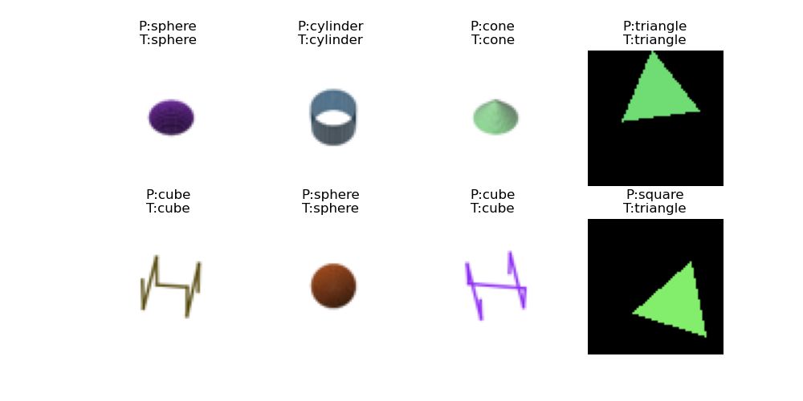
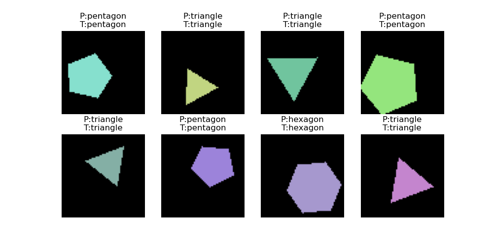
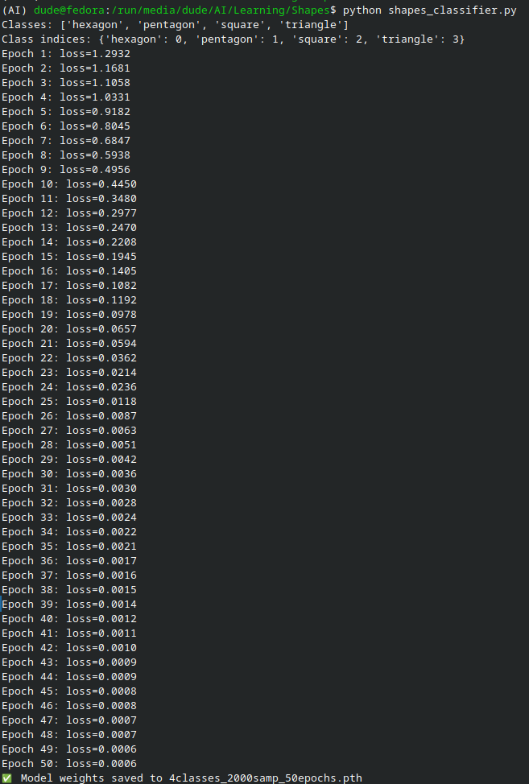

# shapes classifier

### Implemented:
create synthetic data  
train a model  
load/save model  

### Todo:
expand dataset  
  add noise to improve generalisability

### Sample output:

### 5/11/2025

### 4/11/2025

